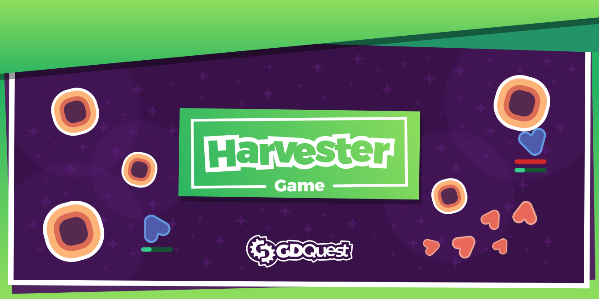
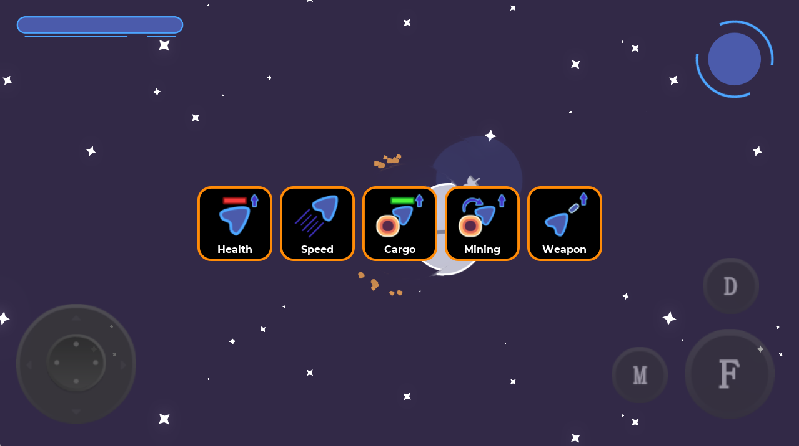
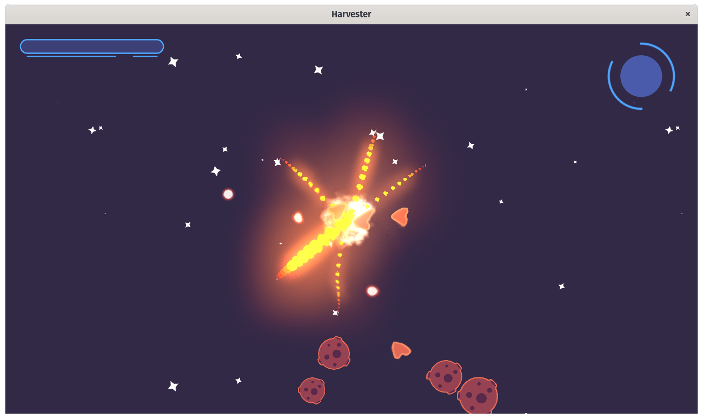
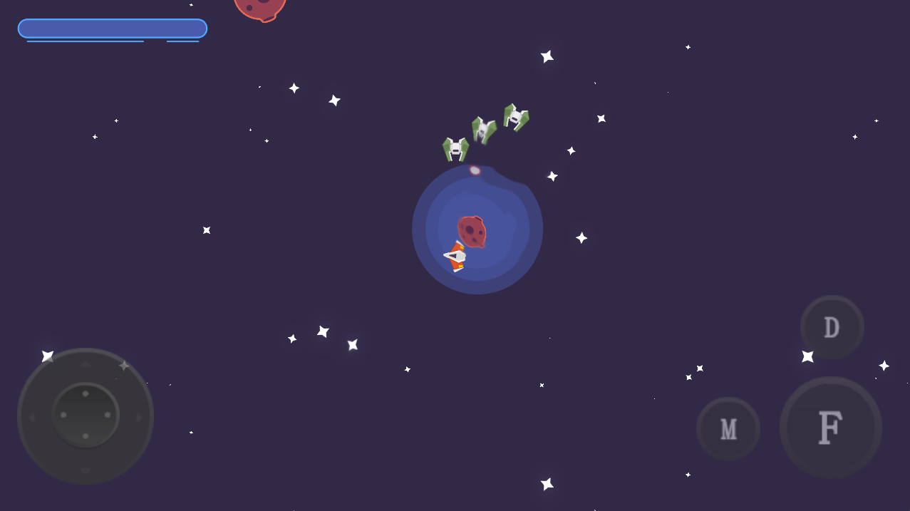

# Harvester

Harvester is a Free and Open-Source top-down space mining game made with the [Godot game engine](https://godotengine.org/). Control your spaceship in forays into an asteroid belt, gather iron, and bring it back to base. Spend them on upgrading your ship's speed and maneuverability and cargo space.

But beware, as you are not alone out here. Pirate miners are out there and want to monopolize the business.

➡ Follow us on [Twitter](https://twitter.com/NathanGDQuest) and [YouTube](https://www.youtube.com/c/gdquest/) for free game creation tutorials, tips, and news! Get one of our [Godot game creation courses](https://gdquest.mavenseed.com/) to support our work on Free Software.

## Summary

The player begins with a ship at their space station in a relatively large, procedurally generated map filled with asteroids. Their job is to navigate their way to find asteroid pockets, dock with them to mine, then dock with the station to drop them off and earn an upgrade.

As they accumulate iron, enemy pirates spawn around asteroid pockets. This forces the player to take different paths until they can destroy the interlopers.

The player continues until they are overwhelmed by the mounting difficulty and growing opposition and sees how far they can go.

## Contributing

Contributors are welcome!

If you encounter a bug, please [open an issue](https://github.com/GDQuest/godot-game-harvester/issues/new).

If you want to contribute to the project, for instance by fixing a bug or adding a feature, check out our:

1. [Contributor's guidelines](https://www.gdquest.com/docs/guidelines/contributing-to/gdquest-projects/).
1. [GDScript style guide](https://www.gdquest.com/docs/guidelines/best-practices/godot-gdscript/)

## Development

The game uses the [Godot Steering AI Framework](https://github.com/GDQuest/godot-steering-ai-framework) while still being a fun time waster.

## Player controls

- Travel mode: use virtual joystick to  rotate  and move the ship.
- Shoot with <kbd>F</kbd> Button. The vessel has energy guns that can become stronger.
- Dock with <kbd>D</kbd> Button: When approaching an asteroid or a station, the player can activate docking mode, and an AI will take over to steer them into position and lock them in place.
- Open the map with <kbd>M</kbd> Button: The player can bring up a navigation map to get a look at where asteroids are and where pirates are.

### Pirates

- Spawning: Every time the player deposits a certain amount of cargo in the station, pirates spawn around some of the asteroids.
- Movement: Pirates move in precision mode. They chase the player, get within weapons fire range, but don't get too close. They do avoid asteroids not to crash into them. Once out of range, they steer back to their spawn point.

### Upgrades

Depositing iron into the station raises a percentage bar. When it hits 100%, the player can select from a small number of upgrades: health, speed, rotation speed, cargo space, and weapons damage.

### Map

The map is made up of a number of asteroid pockets separated by some distance. Asteroids have a certain amount of iron in them and vanish when emptied. More asteroids can spawn on a timer to fill some of the empty gaps.
